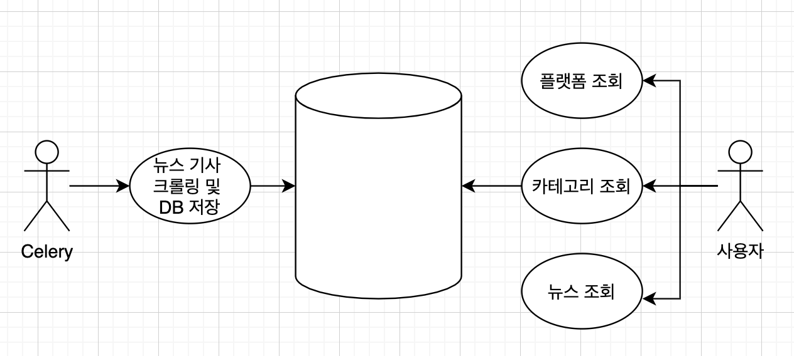

# 클린아키텍처 토이 프로젝트

---

# Use Case


# Diagram


---

# 스포츠 뉴스 API 문서

## BASE URL

- [http://13.209.49.204:9000/](http://13.209.49.204:9000/)

## API를 사용하지 전에 !!

1. api의 url 주소의 형식
    - api/v1/<cateogry> - 꺽쇠 안에 있는 부분은 가변적일 수 있습니다.
        - 예를 들어 api/v1/soccer, api/v1/baseball 등등
        - 각 꺽쇠에 해당되는 url주소가 없을 경우 404 error를 반환 합니다.
        - 404 error
        
        ```json
        {
            "code": 404,
            "message": "Not Found",
            "data": {
                "detail": "flatform not exists"
            }
        }
        ```
        

---

## 1. api/v1/flatforms - GET

- 현재 제공하고 있는 flatform의 목록
- response

```json
{
    "code": 200,
    "message": "OK",
    "data": [
        {
            "id": 1,
            "title": "naver"
        },
        {
            "id": 2,
            "title": "daum"
        }
    ]
}
```

---

## 2. api/v1/<flatform>/categories - GET

- 특정 flatfom에서 제공하고 있는 category의 목록
- response ( url - api/v1/naver/categories )

```json
{
    "code": 200,
    "message": "OK",
    "data": [
        {
            "id": 1,
            "title": "baseball"
        },
        {
            "id": 2,
            "title": "wbaseball"
        },
        {
            "id": 3,
            "title": "football"
        },
        {
            "id": 4,
            "title": "wfootball"
        },
        {
            "id": 5,
            "title": "basketball"
        },
        {
            "id": 6,
            "title": "volleyball"
        },
        {
            "id": 7,
            "title": "golf"
        },
        {
            "id": 8,
            "title": "general"
        },
        {
            "id": 9,
            "title": "esports"
        }
    ]
}
```

---

## 3. api/v1/<flatform>/<category>/stories - GET

- 특정 flatform, 특정 category의 뉴스 목록
- respone ( url - api/v1/naver/baseball/stories )
